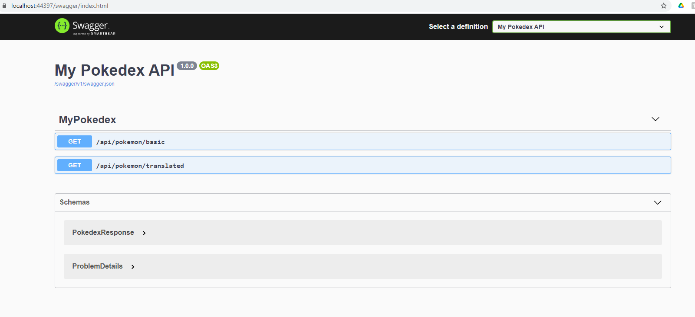
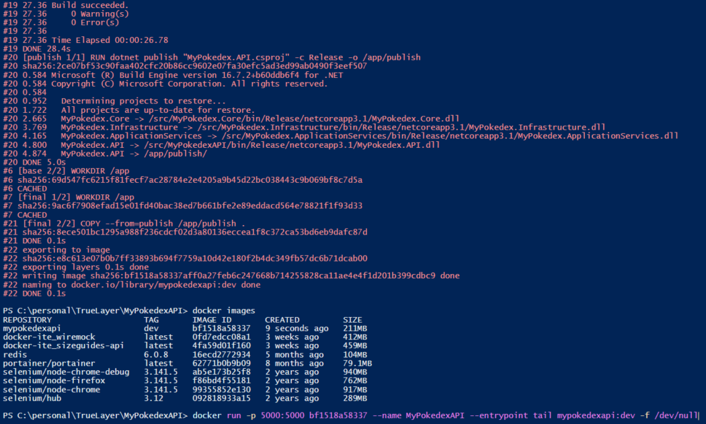
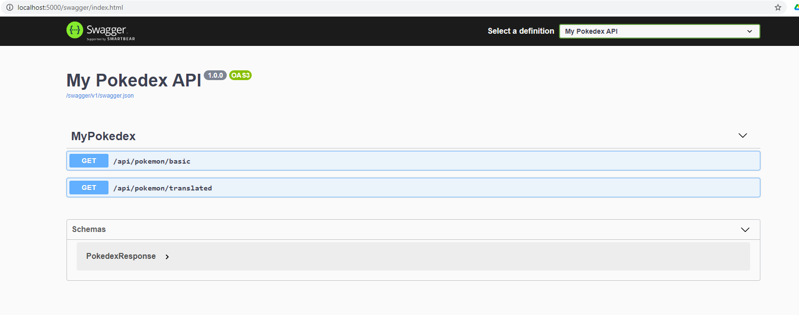
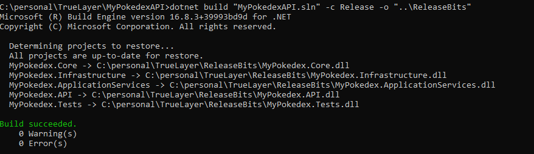
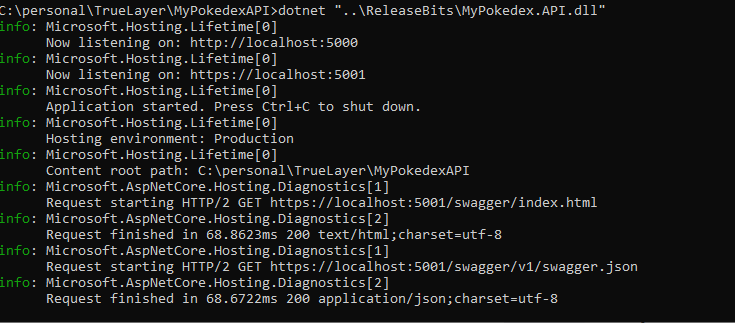
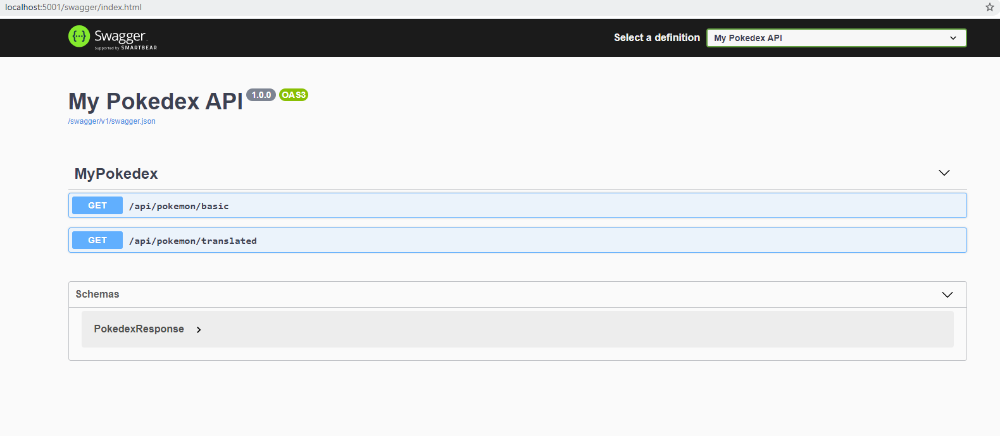
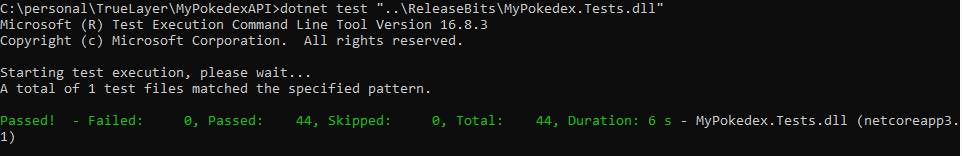
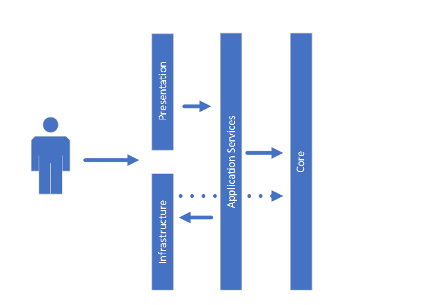

## Description

MyPokedex API is a Restfull API with funny pokemon info. 
Powered by Swagger, you can access the document from https://mypokedexapi.azurewebsites.net/swagger/index.html




****
## Installation

**Step1: Git Clone** 

```` 
HTTPS ⮧
git clone https://github.com/varunpvk/MyPokedex-API.git 
SSH ⮧
git clone git@github.com:varunpvk/MyPokedex-API.git
````

**Step2: Powershell** 


****

____Docker Configuration____

**Step3: Docker Build**

````
docker build -f "<<PathtoRepoDirectory>>\MyPokedexAPI\Dockerfile" . -t mypokedexapi:dev
````


**Step4: Docker Run**
 
````
docker run -p 5000:5000 --name MyPokedexAPI <<mypokedexapi:dev imageid>> --entrypoint tail mypokedex:dev -f /dev/null
````



**Step5: Browse Swagger API from docker container**
 

****

____CLI Configuration____

**Step3: dotnet build**

````
dotnet build -c Release "MyPokedexAPI.sln" -o "..\ReleaseBits"
````



**Step4: dotnet run**

````
dotnet "..\ReleaseBits\MyPokedex.API.dll"
````



**Step5: Browse Swagger locally**



****

## Tests

**Command Line** 

````
dotnet test "..\ReleaseBits\MyPokedex.Tests.dll"
````



## Technical Stack

* .NET Core 3.0.1
* Restfull API
* C#
* XUnit
* Docker && Docker Engine

## Design Spec

* OnionArchitecture
  * External Service Calls are managed by Infrastructure library
  * Features are implemented in ApplicationServices Library
  * Endpoint implementation in WebAPI Project
  * Domain model implementation in Core
* DI
* SOLID principles



## What could be different in production?

* This project is lacking resilience in its design. For instance, when we fail to translate a text, we return original text.
* This can be improved by implementing fallback or cache policy to apply whenever an exception is raised.
* Another food for thought, is to cache the translation response and maintain the translations in a redis cache cluster. This would reduce the network bandwidth greatly, and helps in improving the concurrency request handling efficiency. 
